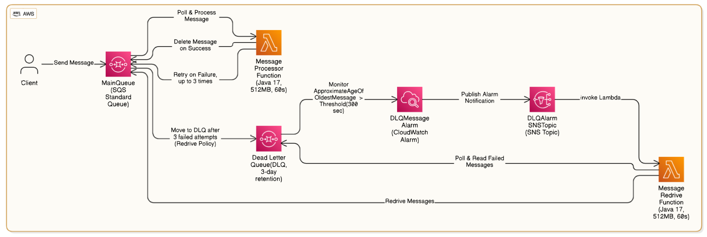

# Automated SQS Dead Letter Queue Redrive with CloudWatch Integration

This project implements an automated message processing system using **AWS SQS** with dead-letter queue (DLQ) handling and automatic message redriving capabilities.  
It provides reliable message processing with automatic error recovery through **CloudWatch monitoring** and **Lambda-based reprocessing**.

The system consists of two main components:
- A **Message Processor Lambda** that handles incoming messages with retry capability.
- A **Message Redrive Lambda** that automatically recovers failed messages from the DLQ when triggered by CloudWatch alarms.

This architecture ensures message processing reliability while minimizing message loss and manual intervention.

---

## Repository Structure

```

.
├── MessageProcessor/                 # Main message processing Lambda function
│   ├── pom.xml                      # Maven configuration for message processor
│   └── src/main/java/
│       └── MessageProcessor.java     # Core message processing logic
├── MessageRedriver/                  # DLQ message recovery Lambda function
│   ├── pom.xml                      # Maven configuration for message redriver
│   └── src/main/java/
│       └── MessageRedrive.java      # DLQ message recovery implementation
├── template.yaml                     # AWS SAM infrastructure definition
├── samconfig.toml                    # SAM CLI configuration
└── pom.xml                          # Parent Maven project configuration

````

---

## Usage Instructions

### Prerequisites
- Java Development Kit (JDK) 17 or later
- Apache Maven 3.8.x or later
- AWS SAM CLI
- AWS CLI configured with appropriate credentials
- AWS account with permissions to create:
  - Lambda functions
  - SQS queues
  - CloudWatch alarms
  - SNS topics
  - IAM roles

---

### Installation

```bash
git clone <repository-url>
cd dlq-redrive-automation-using-CloudWatch
mvn clean package
sam build
sam deploy --guided
````

During guided deployment:

* Confirm the stack name (default: `dlq-redrive-automation-using-CloudWatch`)
* Select the AWS region
* Allow SAM to create IAM roles
* Confirm the deployment changes

---

### Quick Start

Send a test message to the MainQueue:

```bash
aws sqs send-message \
    --queue-url <MAIN_QUEUE_URL> \
    --message-body "Test message"
```

Monitor message processing:

```bash
aws cloudwatch get-metric-statistics \
    --namespace AWS/SQS \
    --metric-name ApproximateNumberOfMessagesVisible \
    --dimensions Name=QueueName,Value=MainQueue \
    --start-time $(date -u -v-1H +%FT%TZ) \
    --end-time $(date -u +%FT%TZ) \
    --period 300 \
    --statistics Sum
```

---

### More Detailed Examples

Test message failure and DLQ processing:

```bash
# Send a message that will fail processing
aws sqs send-message \
    --queue-url <MAIN_QUEUE_URL> \
    --message-body "Test message with fail"

# Check DLQ messages after processing attempts
aws sqs get-queue-attributes \
    --queue-url <DLQ_URL> \
    --attribute-names ApproximateNumberOfMessages
```

---

### Troubleshooting

#### Message Processing Failures

**Problem:** Messages repeatedly failing processing
**Solution:** Check CloudWatch logs at `/aws/lambda/MessageProcessorFunction`

```bash
aws logs get-log-events \
    --log-group-name /aws/lambda/MessageProcessorFunction \
    --log-stream-name <latest-stream>
```

#### DLQ Redrive Issues

**Problem:** Messages not being redriven from DLQ
**Solution:** Verify CloudWatch alarm configuration

```bash
aws cloudwatch describe-alarms \
    --alarm-names DLQMessageAlarm
```

---

## 📊 Architecture Diagram



---

## 🔄 Data Flow

The system processes messages through a main queue with automatic dead-letter queue handling and reprocessing capabilities.

```
                     [MainQueue]
                         │
                         ▼
              [MessageProcessor Lambda]
                         │
           ┌─────────────┴─────────────┐
           │                           │
    [Success Path]                [Failure Path]
           │                           │
     [Processing                       ▼
      Complete]                 [DeadLetterQueue]
                                       │
                                       ▼
                                [CloudWatch Alarm]
                                       │
                                       ▼
                                  [SNS Topic]
                                       │
                                       ▼
                           [MessageRedriver Lambda]
                                       │
                                       ▼
                                  [MainQueue]
```

---

## Component Interactions:

1. Messages arrive in **MainQueue** for processing.
2. **MessageProcessor Lambda** processes messages with retry capability.
3. Failed messages are moved to **DLQ** after 3 retry attempts.
4. **CloudWatch** monitors DLQ message count.
5. When DLQ threshold is reached, **CloudWatch alarm triggers**.
6. **SNS topic** receives the alarm and invokes **MessageRedriver Lambda**.
7. **MessageRedriver Lambda** moves messages back to **MainQueue** for reprocessing.
8. Process continues until messages are successfully processed.

---

## Infrastructure

Infrastructure is defined using AWS SAM and includes:

* **Lambda Functions:**

    * `MessageProcessorFunction`: Processes messages from `MainQueue`.
    * `MessageRedriveFunction`: Handles DLQ message recovery.

* **SQS Queues:**

    * `MainQueue`: Primary message processing queue.
    * `DeadLetterQueue`: Stores failed messages.

* **Monitoring:**

    * `DLQMessageAlarm`: CloudWatch alarm monitoring DLQ.
    * `LogGroupMessageProcessor`: CloudWatch logs for processor.
    * `LogGroupMessageRedrive`: CloudWatch logs for redriver.

* **Messaging:**

    * `DLQAlarmSNSTopic`: SNS topic for alarm notifications.
    * `DLQAlarmSNSTopicSubscription`: Lambda subscription to SNS.

---


